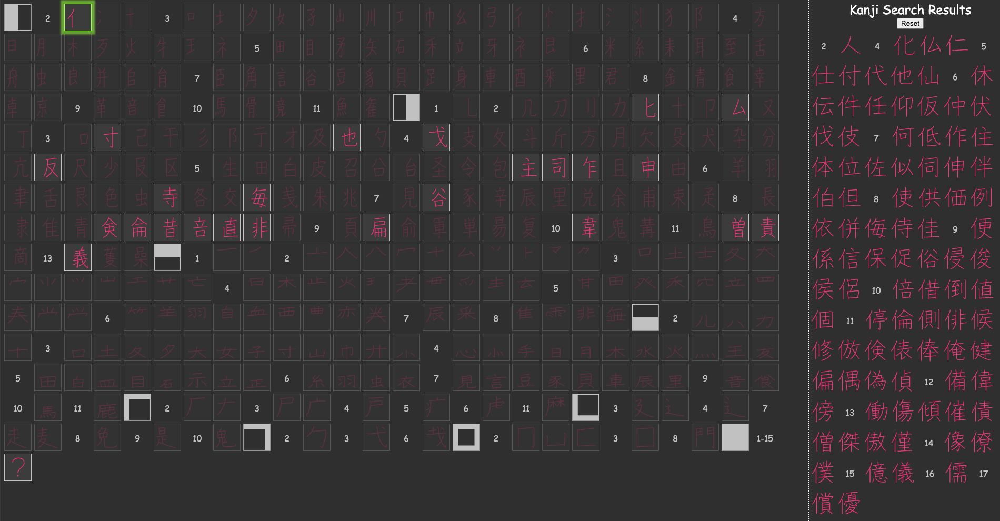

# Kanji Voyager

### About

This tool has been a passion project that Christopher Ball had contemplated for quite some time. Lovingly handcrafted after countless hours of manual labor, with the sole purpose of helping Japanese language learners. The goal was to be able to visually identify any of the 2,136 常用漢字 (jouyou kanji), particularly in books, even when you don't know how to write nor pronounce them.

### How to Use

For any given kanji region ( etc...), apply matching component filters on the left, then click on any resulting kanji to copy it to your clipboard. If a kanji doesn't seem to belong to any region, it has probably been catalogued under the solid region (). Numbers represent stroke counts. Over time, more components will be gradually added for better triangulation.

### Alternative Resources

Many sites and apps rely on freely available, error-prone, dictionary and component-based files (JMDict, KRADFile). Many kanji components can't be separately typed since they don't have their own unicode entries. This tool circumvents this particular problem with handcrafted SVG components, raising the bar on component accuracy.

### Credits

Kanji in Context: A lonesome appendix from this book was the original starter source of component inspiration for this project.

KanjiVG: This github project was the source used for the initial kanji character SVG content, from which all component and kanji derivations were based.

Copyright © 2024 Christopher Ball\
License: MIT License
